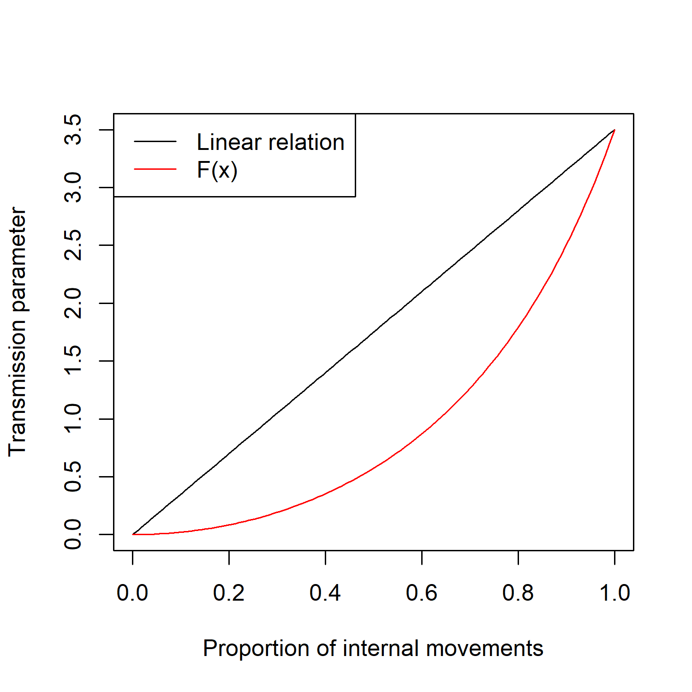

# Model

## Data sources.  

All the data was summarized at hexagon level (15 km diameter).  

### Herd Sim Data

Variables Obtained from this data set:  
  
  - Number of Farms.  
  - Population.  
  - Number of commercial farms.  
  - Number of outdoor operations.  
  - Number of Farrow, Farrow-to-Finish and Finisher.  
  - Expected number of animals per farm.  
  

### Movements records

Variables obtained from this data set:  
  
  - Number of Neighbors based on trade.  
  - List of neighbors for each farm.  
  - Number of internal movements.  
  - Expected number of animals per shipment.  
  - Number of movements in the time period observed.  
  
### demo_Time Series

Variables obtained from this data set:  
  
  - Number of swine cases.  
  - Number of wild cases.  
  

### demo_WB_HuntingBag

Variables obtained from this data set:  
  
  - Number of hunted boars at the administrative level from which the hexagon belongs.  

### Land cover

Variables obtained from this data set:  
  
  - Proportion of coverage of:  
    - Agricultural land.  
    - Forest.  
    - Urban areas.  

## Methodology.

Our model consist of two main components:  

  - **Local transmission.** This component is based on a simple SIR model per hexagon, which uses local population and transmission parameters based on the within hexagon population dynamics.    
  - **Global transmission.** This component is based on the observed trade pasterns at state level. Each hexagon has a set of neighbors and probabilities of trading with those neighbors.   
  
  

### Local Transmission

The local transmission is simulated using Ordinary Differential Equations where each hexagon has its own population parameters based on the population distribution, and its own transmission parameters based on the local activity observed in the network and the susceptibility of the local population.  

The model is a simple SIR described as:  

$$\frac{dS}{dt}=-\frac{\beta IS}{N} \\
 \frac{dI}{dt} = \frac{\beta IS}{N} - \gamma I \\
 \frac{dR}{dt} = \gamma I$$  
 
Where the transmission parameter is weighted based on the number of observed movements within the hexagon to simulate the **within hexagon transmission**. The transmission parameter is bounded between $0.01 > \beta > 3.5$. So when there is an absence of local trade for a given hexagon, the transmission parameter will be 0.01, and when there is a high local trade, the transmission parameter will be close to the upper bound.  
 
The relationship between the probability of local trade happening has a relationship with the transmission parameter based on the function $F(x) = \frac{1}{cos(x)}$

### Global Transmission

The global transmission is modeled based on the observed trade patterns between hexagons. The daily probability and the expected number of animals moved was calculated based on the observed data and assigned to each hexagon along with a list of potential neighbors (destinations).  
Based on the proportion of infected animals per hexagon, we calculated a probability of exporting infected animals. This probability follows a relationship based on the function $F(x) = \frac{1}{cos(x)}$

  
  
  
# Next steps:  
  
  - The $\beta$ and $\gamma$ coefficients used in this model are totally arbitrary, I just used something that sounds ok, but we should check some literature to inform this values. Maybe we could calculate $R_0$ based on the data provided and use this to inform the parameters $\beta$ and $\gamma$.    
  - So far we have only incorporated the movement data into the model, some of the other variables provided could help parametrize better the model and reflect the influence on the wildlife and farm demographics in the disease transmission.  
  
