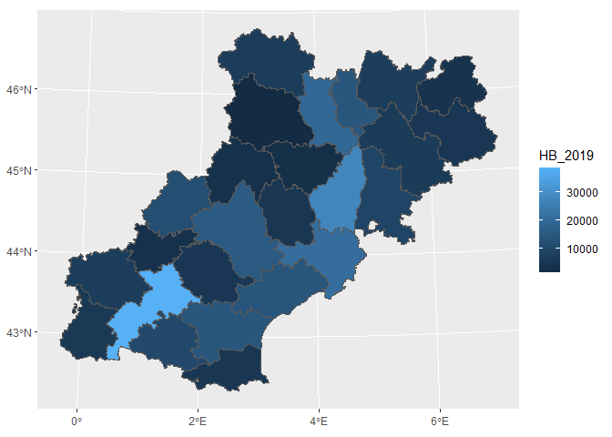
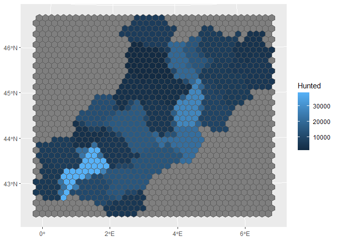

Create Hexagonal Grids
================

``` r
# Load  libraries
library(dplyr)
library(sf)
library(STNet)
library(ggplot2)
library(ggpubr)
library(sp)
library(tidygraph)
library(igraph)
```

# Administrative area

``` r
Is <- st_read("../Data/Island_ADMIN.shp", quiet = T)
```

# Herd sim Data:

Characteristics of all the pig sites that are located in the island

``` r
demo_sim <- read.csv("../Data/demo_herd_sim.csv")
demo_sim <- demo_sim %>%
  mutate(N = 1) %>% # Variable to convert from long to wide
  tidyr::spread(production, N) %>% # COnvert from long to wide for farm types
  replace(., is.na(.), 0) # Replace NAs with 0

#####
#Create spatial object of the farms
SimSp <- demo_sim %>%
  st_as_sf(coords = c("X", "Y"), crs = st_crs(Is))

# Create a field for the hexagonal grid:
Border <- as(raster::extent(SimSp), "SpatialPolygons") %>%
  st_as_sf()
st_crs(Border) <- st_crs(Is)

# Create the Hexagonal grid in the created field:
BorderHex <- HexGrid(cellsize = 15000, Shp = Border)

# Join the hexagons and farms based on the location
SimSp <- SimSp %>%
  st_join(BorderHex) %>% data.frame()

# Summarise the number of farms per hexagon
SimHx <- SimSp %>%
  mutate(N = 1) %>% # create a variable for counting number of farms
  group_by(idhex) %>% # Group by hexagon ID
  summarise_at(.vars = c('N', "size", "is_outdoor", "is_commercial", "multisite", 'Fa', 'FaFi', 'Fi'), .funs = sum) %>% # Sum all the values for these variables
  mutate(density = size / N) # calculate the expected number of animals per farm

#### Join with the hexagonal field 
MapHex <- BorderHex %>%
  left_join(SimHx, by = "idhex")
```

# Movements

``` r
# Load the movements data
demo_moves <- read.csv("../Data/demo_moves.csv")

# Create a variable for type of movement
demo_moves <- demo_moves %>%
  left_join(SimSp[c("ID", "idhex")], by = c("source" = "ID")) %>% # Add hexagon ID for origins
  rename(source_hex = idhex) %>% # rename the variable
  left_join(SimSp[c("ID", "idhex")], by = c("dest" = "ID")) %>% # Add hexid for destinations
  rename(dest_hex = idhex) %>% # Rename the variable
  mutate(N = 1, type = paste0(source.type, '_', dest.type)) %>% # Cretae a variable for type of movement
  tidyr::spread(type, N) %>% # COnvert from long to wide the variable for type
  replace(., is.na(.), 0) # replace the NAs for 0

# Create a network
G <- demo_moves %>%
  select(source_hex, dest_hex) %>%
  graph.data.frame()

# Create a neighbors variable
NbL <- G %>%
  neighborhood(graph = .) %>%
  lapply(., function(x) paste(names(x)[-1] # Get the names of the neighbors (HexID) and remove the first one (bc its self)
                              , collapse = " "))

# Create a Data frame
NbDF <- data.frame(ID = V(G)$name,
                   Nbs = do.call(rbind, NbL), 
                   N_Nbs = neighborhood.size(G) - 1, stringsAsFactors = F)

# Summarise edges
NDF_E <- demo_moves %>%
  mutate(Loop = ifelse(source_hex == dest_hex, 1, 0)) %>%
  group_by(source_hex) %>%
  summarise(E_Animals = mean(qty), Fa_FaFi = sum(Fa_FaFi), Fa_Fi = sum(Fa_Fi), FaFi_FaFi = sum(FaFi_FaFi), FaFi_Fi = sum(FaFi_Fi), Loops = sum(Loop))
  

# Summarise Nodes
NDF_N <- demo_moves %>%
  select(source_hex, dest_hex) %>%
  graph.data.frame() %>%
  as_tbl_graph() %N>%
  mutate(In = degree(., mode = "in"), Out = degree(., mode = "out"), betweenness = betweenness(.)) %>%
  data.frame()

NDF <- NDF_N %>%
  full_join(NDF_E, by = c("name" = "source_hex")) %>%
  full_join(NbDF, by = c("name" = "ID"))

MapHex <- MapHex %>%
  left_join(NDF, by = c("idhex" = "name"))
```

# Outbreaks

Characteristics of the outbreaks and wild boar carcasses

``` r
# Load the data
demo_TS <- read.csv("../Data/demo_TimeSeries.csv")
# Convert to wide format for the host
demo_TS <- demo_TS %>%
  mutate(N = 1) %>%
   tidyr::spread(HOST, N) %>%
  replace(., is.na(.), 0)

# Create spatial points
CasesSp <- demo_TS %>%
  st_as_sf(coords = c("X", "Y"), crs = st_crs(Is))
# Join with hex id
CasesHx <- CasesSp %>% 
  st_join(BorderHex) %>%
  group_by(idhex) %>%
  summarise_at(.vars = c("pig herd", "wild boar"), .funs = sum) %>%
  data.frame()

MapHex <- MapHex %>%
  left_join(CasesHx, by = "idhex")
```

# Hunted boars

Number of boars that were hunted in the administrative unit of the
island

``` r
demo_hunting <- read.csv("../Data/demo_WB_HuntingBag.csv")
Is <- Is %>% 
  mutate(ID = as.integer(as.character(ID))) %>%
  left_join(demo_hunting, by = c("ID" = "ADM"))
```

Now we will use a function to join the hexagons with the administrative
areas based on the amount of overlapping, we will use a treshold of 30%.
This means that if there is \>30% overlap the hexagon will join with the
administrative area.

For the hexagons that joins with more than 2 administrative areas, we
will get a mean for the value of the hunted boars.

``` r
# Set a treshold based on the 30 %
th <- st_area(BorderHex)[1] * 0.3

HuntHex <- MapHex %>%
  st_join(Is, left = T,
    join = STNet::st_overlaps_with_threshold, threshold = units::set_units(th, m^2)) %>% # Join based on the treshold
  group_by(idhex) %>%
  summarise(Hunted = mean(HB_2019, na.rm = T)) %>% # get the average of those hexagons that join with >1 admin area
  data.frame() # convert to a data frame

# Join with the other data
MapHex <- MapHex %>%
  left_join(HuntHex, by = "idhex")

# Compare the two maps 
Is %>%
  ggplot(aes(fill = HB_2019)) +
  geom_sf()
```

<!-- -->

``` r
MapHex %>%
  ggplot(aes(fill = Hunted)) +
  geom_sf()
```

<!-- -->

# Land Cover

``` r
LC <- st_read("../Data/Island_LANDCOVER.shp")
```

    ## Reading layer `Island_LANDCOVER' from data source `C:\Users\jose_\Box Sync\SideQuests\ASF Challenge\ASFChallenge_UCD\Data\Island_LANDCOVER.shp' using driver `ESRI Shapefile'
    ## Simple feature collection with 54011 features and 2 fields
    ## geometry type:  MULTIPOLYGON
    ## dimension:      XY
    ## bbox:           xmin: 428145.7 ymin: 6137116 xmax: 1027293 ymax: 6633766
    ## projected CRS:  Lambert_Conformal_Conic

``` r
# Recode the land cover levels to manipulate later
LC <- LC %>%
  mutate(LC = recode(LANDCOVER, Agricultural = 1, Forest = 10, Urban = 100))
```

We will put all the information in a raster so we can then extract and
summarize the values per hexagon

``` r
library(raster)
# Create an empty raster (increaseing the ncol and nrow will give us a better resolution, but will also increase the computation time)
r <- raster(ncol = 1000, nrow = 1000)
# Set the extent same as the shapefile
extent(r) <- extent(Is)
# Use the function fasterize to sum the number of N over each pixel of our raster
LCr <- fasterize::fasterize(sf = LC, raster = r, field = "LC", fun = "sum")
# Get the unique values to see if worked
unique(values(LCr))
```

    ##  [1]  NA  20   2  10   1 100   3 200   4  30  40

Some of the values are not the ones we recoded for (there might be some
overlapping of the values due to the resolution used), we can see that
the unexpected numbers are just sums of two of the same type, so we will
just replace those:

``` r
# Replace NAs for 0s
LCr[is.na(LCr[])] <- 0
# Replace overlapping raster cells
LCr[(LCr[] > 1 & LCr[] < 9)] <- 1
LCr[(LCr[] > 10 & LCr[] < 90)] <- 10
LCr[(LCr[] > 100 & LCr[] < 900)] <- 100
# Plot the raster
plot(LCr)
```

<!-- -->

Now we will summarise the values per hexagon

``` r
# Create empty vectors
A_vals <- vector()
F_vals <- vector()
U_vals <- vector()
# Make a loop that will run for each hexagon
for(i in 1:nrow(MapHex)){
  # Get the values for each haxagon
  Vals <- raster::extract(LCr, MapHex[i,])
  # get the proportion of each type of land cover
  AVals_i <- length(Vals[[1]][Vals[[1]] == 1]) / length(Vals[[1]])
  FVals_i <- length(Vals[[1]][Vals[[1]] == 10]) / length(Vals[[1]])
  UVals_i <- length(Vals[[1]][Vals[[1]] == 100]) / length(Vals[[1]])
  # create vectors with the values:
  A_vals <- c(A_vals, AVals_i)
  F_vals <- c(F_vals, FVals_i)
  U_vals <- c(U_vals, UVals_i)
}

# Add the values to the Spatial hexagon layer:
MapHex <- MapHex %>%
  mutate(Agricultural = A_vals, Forest = F_vals, Urban = U_vals)
```

``` r
# There was some extra variables joined in the process, so will clean those
MapHex <- MapHex %>%
  dplyr::select(-geometry.x.y, -geometry.x.y, -geometry.y) %>%
  rename(geometry = geometry.x.x, N_Farms = N, Population = size, Outdoor = is_outdoor, Commercial = is_commercial)

# st_write(MapHex, "../Data/DF/Shapefiles/MapHx.shp")
```

Create a subset of the hexagons that has swine population:

``` r
FarmsHx <- MapHex %>%
  filter(!is.na(N_Farms)) %>%
  replace(., is.na(.), 0)
# st_write(FarmsHx, "../Data/DF/Shapefiles/FarmsHx.shp")
```
