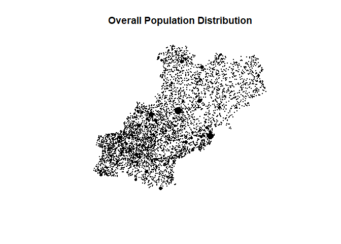
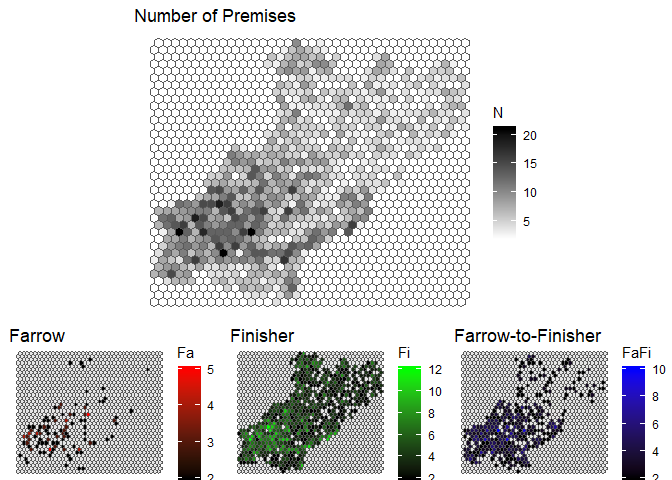
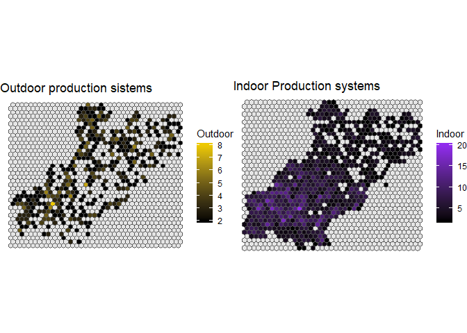
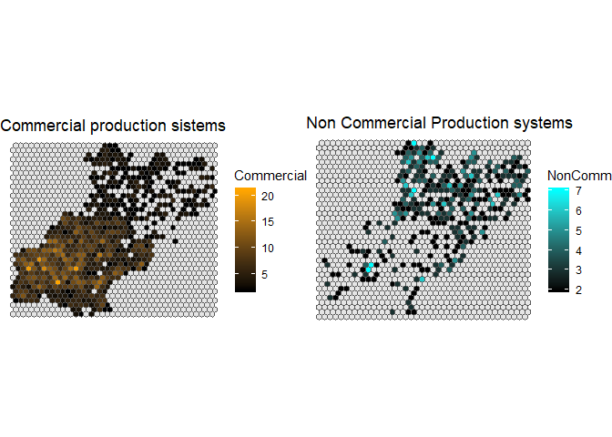
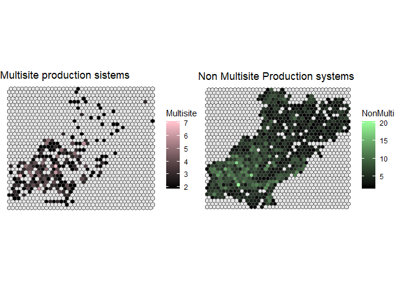
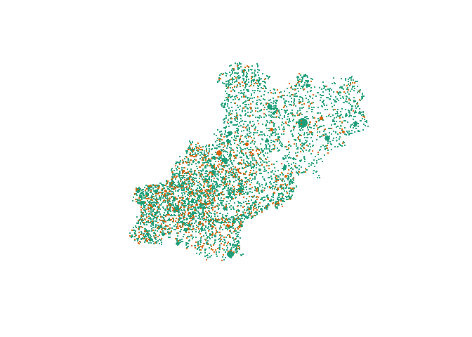
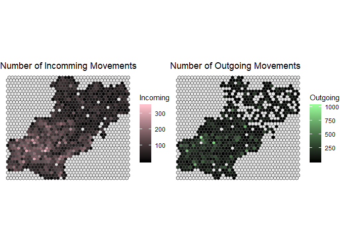
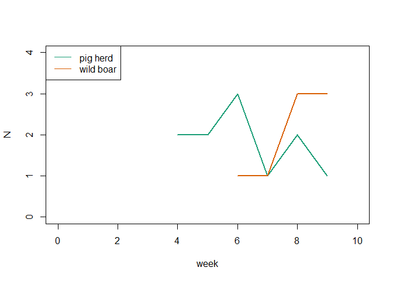
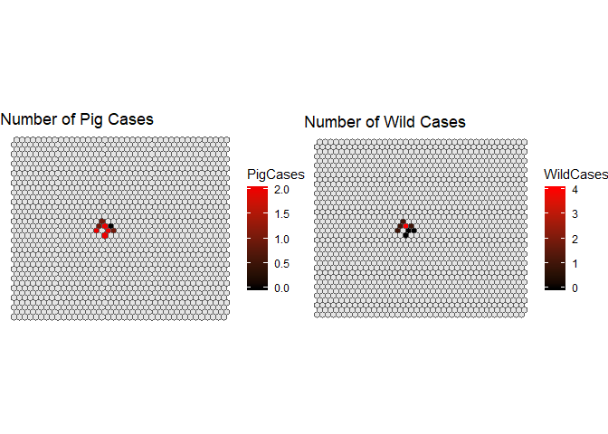
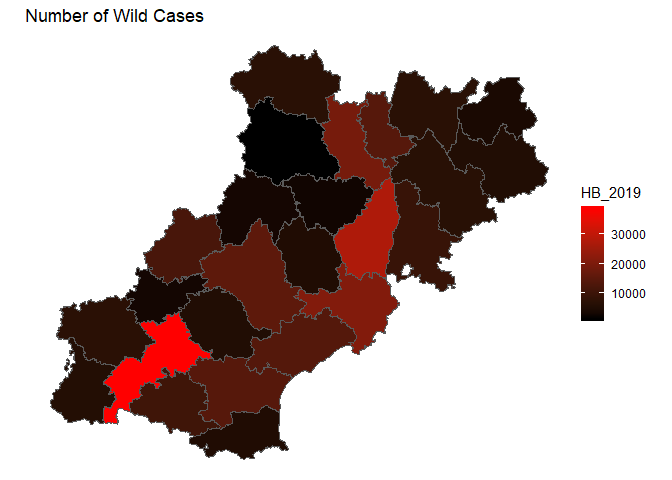

Data Exploration
================

``` r
knitr::opts_chunk$set(message = F, warning = F)
```

Load the libraries

``` r
library(dplyr)
library(sf)
library(STNet)
library(ggplot2)
library(ggpubr)
library(sp)
```

# Administrative area

``` r
Is <- st_read("../Data/Island_ADMIN.shp", quiet = T)
```

# Herd sim Data:

Characteristics of all the pig sites that are located in the island

``` r
demo_sim <- read.csv("../Data/demo_herd_sim.csv")
```

SUmmary of the number of pigs for each type of farm:

``` r
sim_sum <- demo_sim %>%
  group_by(production) %>%
  mutate(mean = mean(size), sd = sd(size)) %>%
  summarise(N = n(), Pop = sum(size), mean = first(mean), sd = first(sd), is_outdoor = sum(is_outdoor), is_commercial = sum(is_commercial))
sim_sum
```

    ## # A tibble: 3 x 7
    ##   production     N     Pop  mean    sd is_outdoor is_commercial
    ##   <fct>      <int>   <int> <dbl> <dbl>      <int>         <int>
    ## 1 Fa           467 1636238 3504. 3558.         37           435
    ## 2 FaFi        1389  815019  587.  618.        149          1330
    ## 3 Fi          2919 1795993  615.  892.       1121          1820

``` r
SimSp <- demo_sim %>%
  st_as_sf(coords = c("X", "Y"))

# Overall Population distribution
SimSp %>%
  st_geometry() %>%
  plot(pch = 16, cex = scales::rescale(SimSp$size, to = c(0.01, 2)), main = "Overall Population Distribution")
```

<!-- -->

Now I will summarise the data by hexagonal grids, I am using a package
that you need to install from github using
`devtools::install_github("jpablo91/STNet")`

``` r
# Create a field for the hexagonal grid:
Border <- as(raster::extent(SimSp), "SpatialPolygons") %>%
  st_as_sf()

# Create the Hexagonal grid in the created field:
BorderHex <- STNet::HexGrid(mycellsize = 15000, Shp = Border)
# COunt the number of points (Farms) per hexagon
SimHx <- STNet::HexMap(Hex = BorderHex, Points = SimSp)
# Now count the number of type of farms per hexagon
# For Farrowing
MapHx <- SimSp %>%
  filter(production == "Fa") %>%
  HexMap(Hex = BorderHex, .) %>%
  rename(Fa = N)
  # FOr Finisher
FiV <- SimSp %>%
  filter(production == "Fi") %>%
  HexMap(Hex = BorderHex, .) %>% pull(N)
# For Farrow-to_Finish
FiFaV <- SimSp %>%
  filter(production == "FaFi") %>%
  HexMap(Hex = BorderHex, .) %>%
  pull(N)
# The total number of farms
NV <- SimSp %>%
  HexMap(Hex = BorderHex, .) %>%
  pull(N)


# Add the columns to the spatial object:
MapHx <- MapHx %>%
  mutate(Fi = FiV, FaFi = FiFaV, N = NV) 

# Remove the vector with the counts
rm(FiV, FiFaV, NV)

# Create the maps:
P <- MapHx %>%
  ggplot(., aes(fill = N)) +
  geom_sf() +
  scale_fill_gradient(low="white", high="black", na.value = "white") +
  ggtitle("Number of Premises") +
  theme_void()

P1 <- MapHx %>%
  ggplot(., aes(fill = Fa)) +
  geom_sf() +
  scale_fill_gradient(low="black", high="red", na.value = "grey90") +
  ggtitle("Farrow") +
  theme_void()

P2 <- MapHx %>%
  ggplot(., aes(fill = Fi)) +
  geom_sf() +
  scale_fill_gradient(low="black", high="green", na.value = "grey90") +
  ggtitle("Finisher") +
  theme_void()

P3 <- MapHx %>%
  ggplot(., aes(fill = FaFi)) +
  geom_sf() +
  scale_fill_gradient(low="black", high="blue", na.value = "grey90") +
  ggtitle("Farrow-to-Finisher") +
  theme_void()

# Plot the maps in a layout
ggarrange(P,
          ggarrange(P1, P2, P3, nrow = 1), nrow = 2, heights = c(2, 1))
```

<!-- -->

Stratify by Indoor vs Outdoor:

``` r
OutdoorV <- SimSp %>%
  filter(is_outdoor == 1) %>%
  HexMap(Hex = BorderHex, .) %>% pull(N)

IndoorV <- SimSp %>%
  filter(is_outdoor == 0) %>%
  HexMap(Hex = BorderHex, .) %>% pull(N)

MapHx <- MapHx %>%
  mutate(Outdoor = OutdoorV, Indoor = IndoorV)

Q1 <- MapHx %>%
  ggplot(., aes(fill = Outdoor)) +
  geom_sf() +
  scale_fill_gradient(low="black", high="gold2", na.value = "grey90") +
  ggtitle("Outdoor production sistems") +
  theme_void()

Q2 <- MapHx %>%
  ggplot(., aes(fill = Indoor)) +
  geom_sf() +
  scale_fill_gradient(low="black", high="purple2", na.value = "grey90") +
  ggtitle("Indoor Production systems") +
  theme_void()

ggarrange(Q1, Q2, nrow = 1)
```

<!-- -->

Stratify by comercial vs Non-Commercial.

``` r
CommercialV <- SimSp %>%
  filter(is_commercial == 1) %>%
  HexMap(Hex = BorderHex, .) %>% pull(N)

NonCommV <- SimSp %>%
  filter(is_commercial == 0) %>%
  HexMap(Hex = BorderHex, .) %>% pull(N)

MapHx <- MapHx %>%
  mutate(Commercial = CommercialV, NonComm = NonCommV)

C1 <- MapHx %>%
  ggplot(., aes(fill = Commercial)) +
  geom_sf() +
  scale_fill_gradient(low="black", high="orange", na.value = "grey90") +
  ggtitle("Commercial production sistems") +
  theme_void()

C2 <- MapHx %>%
  ggplot(., aes(fill = NonComm)) +
  geom_sf() +
  scale_fill_gradient(low="black", high="cyan", na.value = "grey90") +
  ggtitle("Non Commercial Production systems") +
  theme_void()

ggarrange(C1, C2, nrow = 1)
```

<!-- -->

Stratify by multi-site vs single site.

``` r
NMSV <- SimSp %>%
  filter(multisite == 0) %>%
  HexMap(Hex = BorderHex, .) %>% pull(N)

MSV <- SimSp %>%
  filter(multisite != 0) %>%
  HexMap(Hex = BorderHex, .) %>% pull(N)

MapHx <- MapHx %>%
  mutate(Multisite = MSV, NonMulti = NMSV)

C1 <- MapHx %>%
  ggplot(., aes(fill = Multisite)) +
  geom_sf() +
  scale_fill_gradient(low="black", high="pink", na.value = "grey90") +
  ggtitle("Multisite production sistems") +
  theme_void()

C2 <- MapHx %>%
  ggplot(., aes(fill = NonMulti)) +
  geom_sf() +
  scale_fill_gradient(low="black", high="palegreen", na.value = "grey90") +
  ggtitle("Non Multisite Production systems") +
  theme_void()

ggarrange(C1, C2, nrow = 1)
```

<!-- -->

Plot the points Multisite vs one site only.

``` r
colpal <- RColorBrewer::brewer.pal(3, "Dark2")
# Distribution by Multisite vs Not
SimSp %>%
  filter(multisite == 0) %>%
  st_geometry() %>%
  plot(pch = 16, cex = scales::rescale(SimSp$size, to = c(0.01, 2)), col = colpal[1])

SimSp %>%
  filter(multisite != 0) %>%
  st_geometry() %>%
  plot(pch = 16, cex = scales::rescale(SimSp$size, to = c(0.01, 2)), col = colpal[2], add = T)
```

<!-- -->

# Movements Data:

``` r
demo_moves <- read.csv("../Data/demo_moves.csv")
SimSp <- SimSp %>%
  st_join(BorderHex)

demo_moves <- demo_moves %>%
  left_join(SimSp[c("ID", "idhex")], by = c("source" = "ID")) %>%
  rename(source_hex = idhex) %>%
  left_join(SimSp[c("ID", "idhex")], by = c("dest" = "ID")) %>%
  rename(dest_hex = idhex) %>%
  select(-geometry.x, -geometry.y)

In <- demo_moves %>%
  group_by(source_hex) %>%
  summarise(Outgoing = n())

Out <- demo_moves %>%
  group_by(dest_hex) %>%
  summarise(Incoming = n())

MapHx <- MapHx %>%
  left_join(In, by = c("idhex" = "source_hex")) %>%
  left_join(Out, by = c("idhex" = "dest_hex")) 

M1 <- MapHx %>%
  ggplot(., aes(fill = Incoming)) +
  geom_sf() +
  scale_fill_gradient(low="black", high="pink", na.value = "grey90") +
  ggtitle("Number of Incomming Movements") +
  theme_void()

M2 <- MapHx %>%
  ggplot(., aes(fill = Outgoing)) +
  geom_sf() +
  scale_fill_gradient(low="black", high="palegreen", na.value = "grey90") +
  ggtitle("Number of Outgoing Movements") +
  theme_void()

ggarrange(M1, M2, nrow = 1)
```

<!-- -->

# Time Series

Characteristics of the outbreaks and wild boar carcasses

``` r
demo_TS <- read.csv("../Data/demo_TimeSeries.csv")
```

Create an Epidemic curve:

``` r
# Create a week variable
demo_TS$week <- cut(demo_TS$DATE.SUSP, 
                    breaks = seq(from = 0, to = 63, by = 7), # create breaks every 7 days 
                    labels = (1:9)) %>%# Asign a week number
  as.character() %>% as.numeric()


wts <- demo_TS %>% 
  group_by(HOST, week) %>%
  summarise(N = n())


plot(N~week, wts[wts$HOST == "pig herd",], type = "l", xlim = c(0,10), ylim = c(0, max(wts$N)+1), col = colpal[1], lwd = 2)
lines(N~week, wts[wts$HOST == "wild boar",], xlim = c(0,10), ylim = c(0, max(wts$N)+1), col = colpal[2], lwd = 2)
legend("topleft", legend = c(c("pig herd", "wild boar")), col = colpal[1:2], lty = 1)
```

<!-- -->

``` r
CasesSp <- demo_TS %>%
  st_as_sf(coords = c("X", "Y"))

CasesSp <- CasesSp %>% 
  st_join(BorderHex)

CasesHx <- CasesSp %>%
  mutate(PigCases = ifelse(HOST == "pig herd", 1, 0),
         WildCases = ifelse(HOST == "wild boar", 1, 0)) %>%
  group_by(idhex) %>%
  summarise(PigCases = sum(PigCases), WildCases = sum(WildCases)) %>%
  data.frame() %>%
  select(-geometry)

MapHx <- MapHx %>%
  left_join(CasesHx, by = "idhex")
  

C1 <- MapHx %>%
  ggplot(., aes(fill = PigCases)) +
  geom_sf() +
  scale_fill_gradient(low="black", high="red2", na.value = "grey90") +
  ggtitle("Number of Pig Cases") +
  theme_void()

C2 <- MapHx %>%
  ggplot(., aes(fill = WildCases)) +
  geom_sf() +
  scale_fill_gradient(low="black", high="red", na.value = "grey90") +
  ggtitle("Number of Wild Cases") +
  theme_void()

ggarrange(C1, C2, nrow = 1)
```

<!-- -->

# Hunted boars

Number of boars that were hunted in the administrative unit of the
island

``` r
demo_hunting <- read.csv("../Data/demo_WB_HuntingBag.csv")
Is <- Is %>% 
  mutate(ID = as.integer(as.character(ID))) %>%
  left_join(demo_hunting, by = c("ID" = "ADM"))

Is %>%
  ggplot(., aes(fill = HB_2019)) +
  geom_sf() +
  scale_fill_gradient(low="black", high="red", na.value = "grey90") +
  ggtitle("Number of Wild Cases") +
  theme_void()
```

<!-- -->

# Land Cover

``` r
LC <- st_read("../Data/Island_LANDCOVER.shp")
```

    ## Reading layer `Island_LANDCOVER' from data source `C:\Users\jose_\Box Sync\SideQuests\ASF Challenge\ASFChallenge_UCD\Data\Island_LANDCOVER.shp' using driver `ESRI Shapefile'
    ## Simple feature collection with 54011 features and 2 fields
    ## geometry type:  MULTIPOLYGON
    ## dimension:      XY
    ## bbox:           xmin: 428145.7 ymin: 6137116 xmax: 1027293 ymax: 6633766
    ## epsg (SRID):    NA
    ## proj4string:    +proj=lcc +lat_1=44 +lat_2=49 +lat_0=46.5 +lon_0=3 +x_0=700000 +y_0=6600000 +ellps=GRS80 +units=m +no_defs

``` r
# SUmmarize the land cover details
LC %>% data.frame() %>%
  group_by(LANDCOVER) %>%
  summarise(N= n())
```

    ## # A tibble: 3 x 2
    ##   LANDCOVER        N
    ##   <fct>        <int>
    ## 1 Agricultural 16560
    ## 2 Forest       26838
    ## 3 Urban        10613

``` r
# Recode the land cover levels to manipulate later
LC <- LC %>%
  mutate(LC = recode(LANDCOVER, Agricultural = 1, Forest = 10, Urban = 100))
```

We will put all the information in a raster so we can then extract and
summarize the values per hexagon

``` r
library(raster)
# Create an empty raster (increaseing the ncol and nrow will give us a better resolution, but will also increase the computation time)
r <- raster(ncol = 1000, nrow = 1000)
# Set the extent same as the shapefile
extent(r) <- extent(Is)
# Use the function fasterize to sum the number of N over each pixel of our raster
LCr <- fasterize::fasterize(sf = LC, raster = r, field = "LC", fun = "sum")
# Get the unique values to see if worked
unique(values(LCr))
```

    ##  [1]  NA  20   2  10   1 100   3 200   4  30  40

Some of the values are not the ones we recoded for (there might be some
overlapping of the values due to the resolution used), we can see that
the unexpected numbers are just sums of two of the same type, so we will
just replace those:

``` r
# Replace NAs for 0s
LCr[is.na(LCr[])] <- 0
# Replace overlapping raster cells
LCr[(LCr[] > 1 & LCr[] < 9)] <- 1
LCr[(LCr[] > 10 & LCr[] < 90)] <- 10
LCr[(LCr[] > 100 & LCr[] < 900)] <- 100
# Plot the raster
plot(LCr)
```

<!-- -->

Now we will summarise the values per hexagon

``` r
# Create empty vectors
A_vals <- vector()
F_vals <- vector()
U_vals <- vector()
# Make a loop that will run for each hexagon
for(i in 1:nrow(MapHx)){
  # Get the values for each haxagon
  Vals <- extract(LCr, MapHx[i,])
  # get the proportion of each type of land cover
  AVals_i <- length(Vals[[1]][Vals[[1]] == 1]) / length(Vals[[1]])
  FVals_i <- length(Vals[[1]][Vals[[1]] == 10]) / length(Vals[[1]])
  UVals_i <- length(Vals[[1]][Vals[[1]] == 100]) / length(Vals[[1]])
  # create vectors with the values:
  A_vals <- c(A_vals, AVals_i)
  F_vals <- c(F_vals, FVals_i)
  U_vals <- c(U_vals, UVals_i)
  }
# Add the values to the Spatial hexagon layer:
MapHx <- MapHx %>%
  mutate(Agricultural = A_vals, Forest = F_vals, Urban = U_vals)
```

Visualize the results

``` r
LC1 <- MapHx %>%
  ggplot(., aes(fill = Agricultural)) +
  geom_sf() +
  scale_fill_gradient(low="black", high="gold2", na.value = "grey90") +
  ggtitle("Proportion of Agricultural Cover") +
  theme_void()

LC2 <- MapHx %>%
  ggplot(., aes(fill = Forest)) +
  geom_sf() +
  scale_fill_gradient(low="black", high="green", na.value = "grey90") +
  ggtitle("Proportion of Forest Cover") +
  theme_void()

LC3 <- MapHx %>%
  ggplot(., aes(fill = Urban)) +
  geom_sf() +
  scale_fill_gradient(low="black", high="red", na.value = "grey90") +
  ggtitle("Proportion of Urban Cover") +
  theme_void()

ggarrange(LC1, LC2, LC3, nrow = 1)
```

<!-- -->

``` r
MapHxs <- MapHx %>%
  filter(Agricultural != 0 &
           Forest != 0 &
           Urban !=0)

MapHxs[is.na(MapHxs)] <- 0

MapHxs %>% 
  filter(WildCases != 0)
```

    ## Simple feature collection with 5 features and 18 fields
    ## geometry type:  POLYGON
    ## dimension:      XY
    ## bbox:           xmin: 653520.2 ymin: 6369143 xmax: 706020.2 ymax: 6412445
    ## epsg (SRID):    NA
    ## proj4string:    NA
    ## # A tibble: 5 x 19
    ##   idhex    Fa                  geometry    Fi  FaFi     N Outdoor Indoor
    ## * <fct> <dbl>                 <POLYGON> <dbl> <dbl> <dbl>   <dbl>  <dbl>
    ## 1 ID718     2 ((653520.2 6382134, 6610~     4     5    11       0     10
    ## 2 ID757     0 ((661020.2 6395124, 6685~     3     2     5       0      5
    ## 3 ID758     0 ((676020.2 6395124, 6835~     5     0     6       0      5
    ## 4 ID759     0 ((691020.2 6395124, 6985~     2     0     2       0      2
    ## 5 ID797     0 ((668520.2 6408115, 6760~     4     6    11       0     10
    ## # ... with 11 more variables: Commercial <dbl>, NonComm <dbl>, Multisite <dbl>,
    ## #   NonMulti <dbl>, Outgoing <dbl>, Incoming <dbl>, PigCases <dbl>,
    ## #   WildCases <dbl>, Agricultural <dbl>, Forest <dbl>, Urban <dbl>
