Simulations Output
================

Setting up the workplace
========================

Read in data for various scenarios
==================================

-   Scenario 0: Baseline
-   Scenario 01: Movement restrictions
-   Scenario 02: Movement restrictions and hunting pressure
-   Scenario 03: Movement restrictions, hunting pressure and fencing

### Variables from the 'EC' folder:

-   *cycle:* time step of the simulation.
-   *Infected\_P:* Number of infected pig herds.
-   *Infected\_WB:* Number of infected wild Boars.
-   *Sim:* Iteration of the simulation.

  

Plot of infected domestic pigs and wild boars over time
=======================================================

### Scenario 0: Baseline

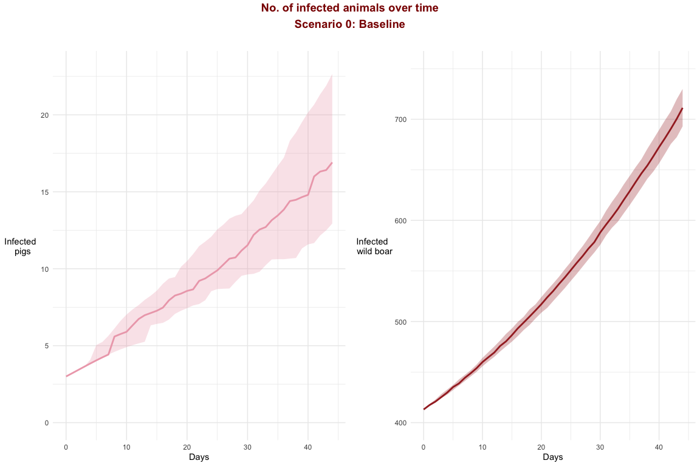

### Scenario 01: Movement restrictions

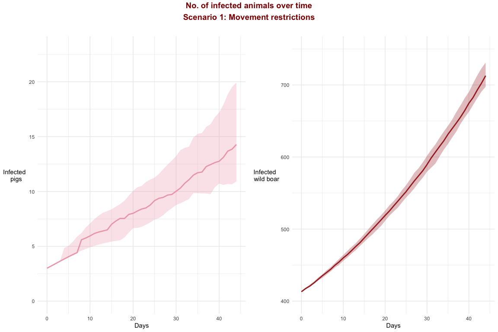

### Scenario 02: Movement restrictions and hunting pressure

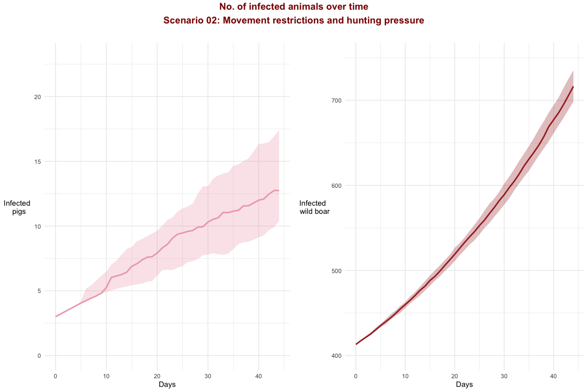

### Scenario 03: Movement restrictions, hunting pressure and fencing

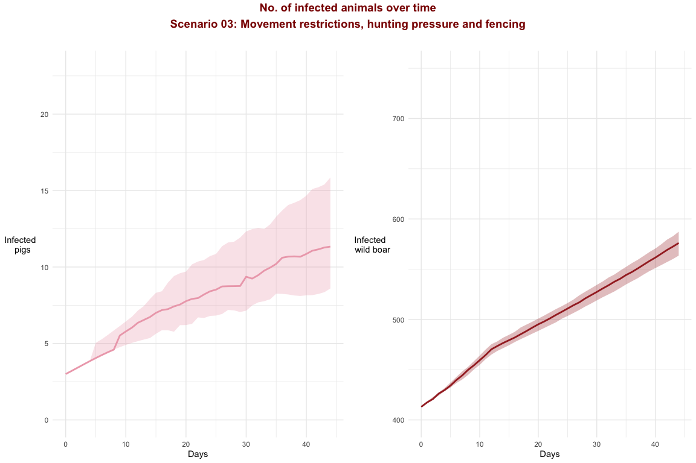

  

Maps of infected areas
======================

Variables from the Agents folder:
- *idhex:* Id of the hexagonal cell.
- *Epidemic:* Number of times that there was an epidemic on that polygon.
- *introduction\_ph:* Number of times that an infected pig was introduced to the polygon from other polygon.
- *introduction\_wb:* Number of times the disease was transmitted from wild boars to a pig herd.

### Scenario 0: Baseline

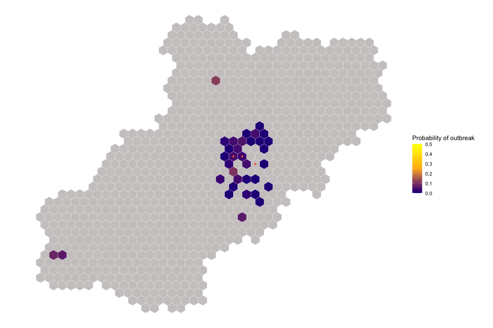

### Scenario 01: Movement restrictions

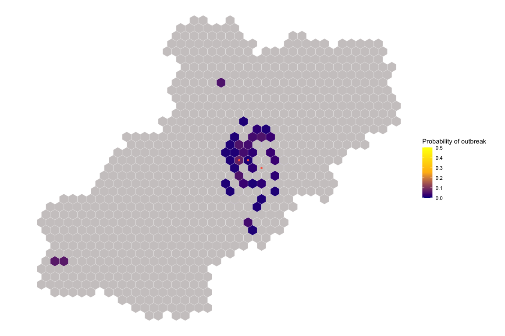

### Scenario 02: Movement restrictions and hunting pressure

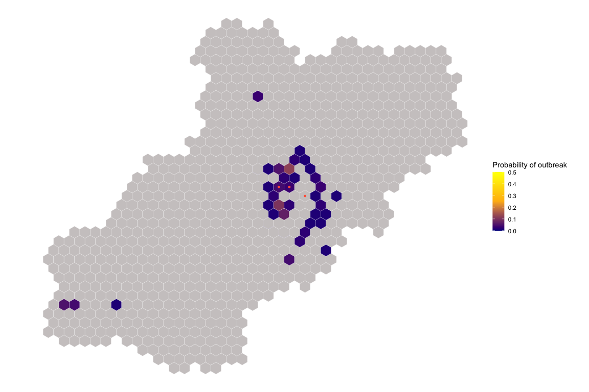

### Scenario 03: Movement restrictions, hunting pressure and fencing

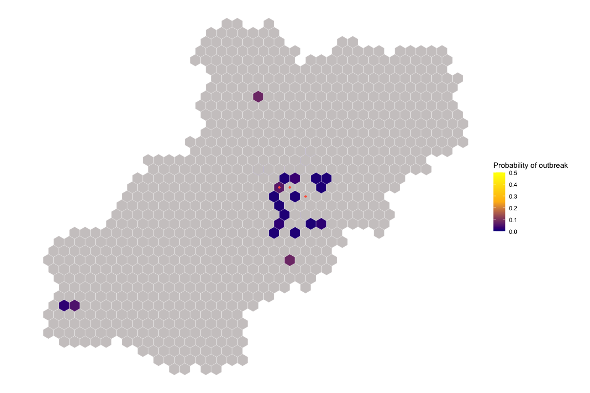

  

All scenarios together
======================

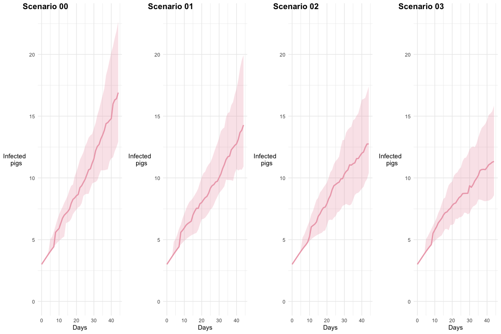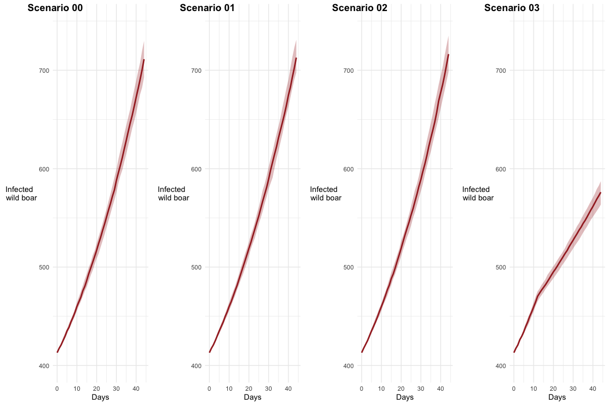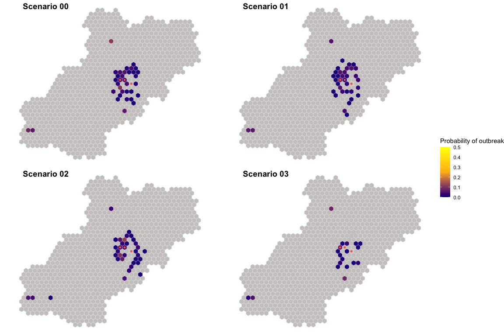

  

Summary plot
============

    ## # A tibble: 4 x 2
    ##   S          `median(I_P)`
    ##   <chr>              <dbl>
    ## 1 Scenario 0          16.9
    ## 2 Scenario 1          14.5
    ## 3 Scenario 2          13.0
    ## 4 Scenario 3          11.9

    ## [1] 0.2314539

    ## [1] 0.2977669
