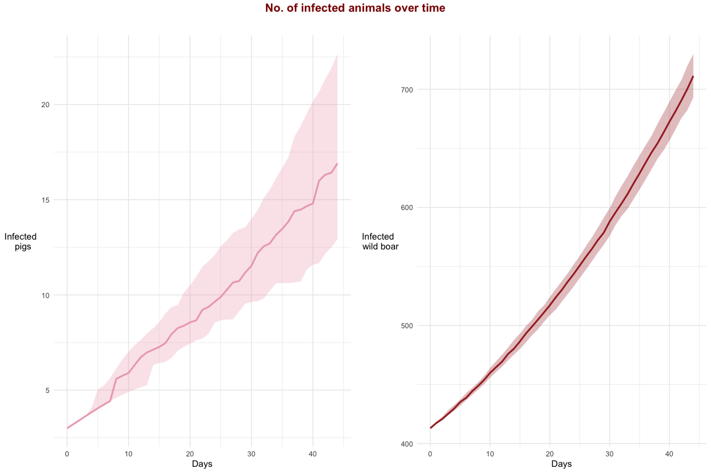
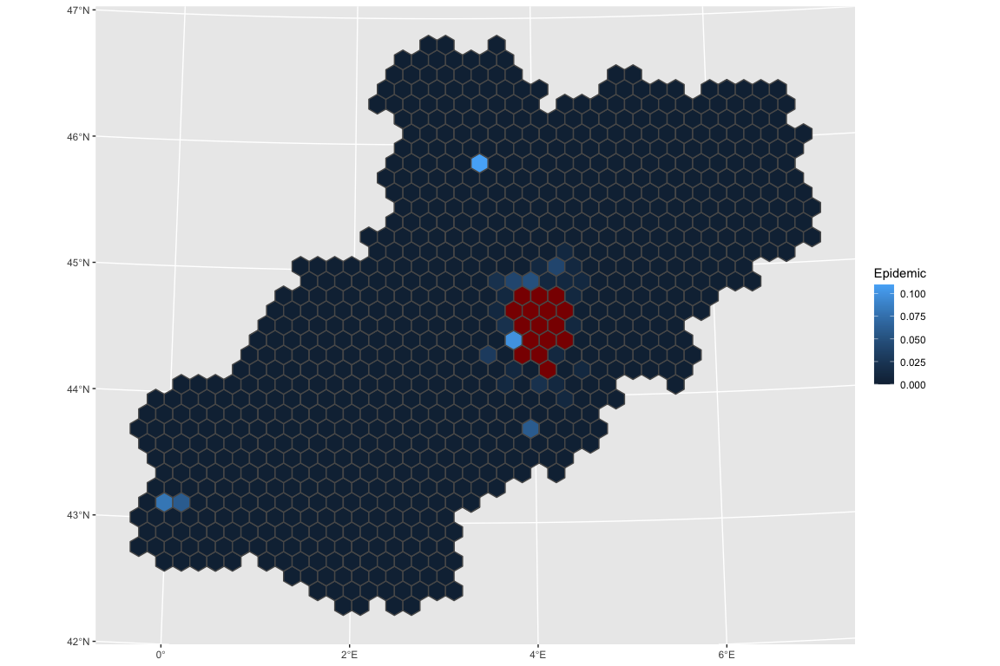
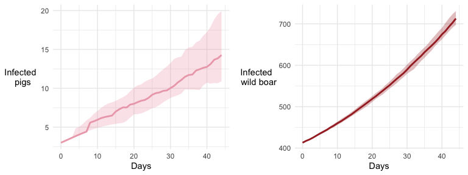
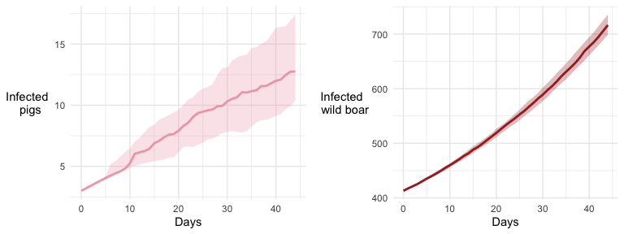
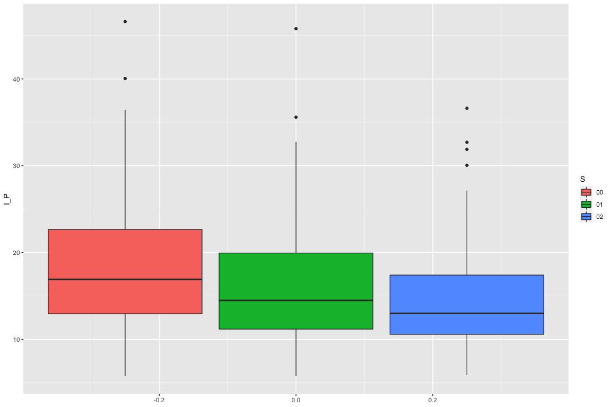
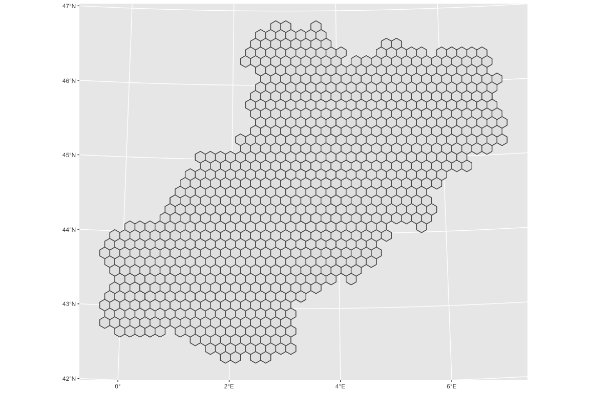
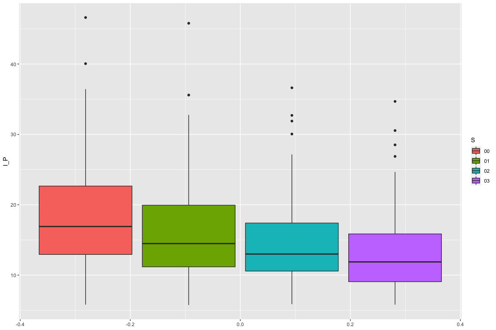

Simulations Output
================

### Variables from the ‘EC’ folder:

  - *cycle:* time step of the simulation.  
  - *Infected\_P:* Number of infected pig herds.  
  - *Infected\_WB:* Number of infected wild Boars.  
  - *Sim:* Iteration of the simulation.

  

# Scenario 0: Baseline

## Plot of infcted domestic pigs and wild bor over time

<!-- -->

## Map

Variables from the Agents folder:  
\- *idhex:* Id of the hexagonal cell.  
\- *Epidemic:* Number of times that there was an epidemic on that
polygon.  
\- *introduction\_ph:* Number of times that an infected pig was
introduced to the polygon from other polygon.  
\- *introduction\_wb:* Number of times the disease was transmitted from
wild boars to a pig herd.

<!-- -->

# Scenario 01: Movement restrictions

<!-- -->

## Map

<!-- -->

# Scenario 02: Movement restrictions and hunting pressure

<!-- -->

<!-- -->

## Map

<!-- -->

# Scenario 03: Movement restrictions, hunting pressure and fencing

<!-- -->

## Map

<!-- -->

<!-- -->

    ## # A tibble: 1,190 x 4
    ##    idhex Epidemic introduction_ph introduction_wb
    ##    <chr>    <dbl>           <int>           <int>
    ##  1 591        100               0              31
    ##  2 623        100               0              10
    ##  3 625        100               0             114
    ##  4 589         73               0             138
    ##  5 627         39               0              43
    ##  6 663         21               0              22
    ##  7 515         18               0              22
    ##  8 587         18               0              18
    ##  9 660         13               0              16
    ## 10 701         12               0              13
    ## # … with 1,180 more rows

## Conclusion

<!-- -->

    ## # A tibble: 4 x 2
    ##   S     `median(I_P)`
    ##   <chr>         <dbl>
    ## 1 00             16.9
    ## 2 01             14.5
    ## 3 02             13.0
    ## 4 03             11.9

    ## [1] 0.25

\======= \>\>\>\>\>\>\> 50c037d3b3b45697cb64482422c1d186ea4b0951
