Simulations Output
================

``` r
library(dplyr); library(ggplot2); library(ggpubr); library(sf)
```

    ## Warning: package 'dplyr' was built under R version 3.6.3

    ## 
    ## Attaching package: 'dplyr'

    ## The following objects are masked from 'package:stats':
    ## 
    ##     filter, lag

    ## The following objects are masked from 'package:base':
    ## 
    ##     intersect, setdiff, setequal, union

    ## Warning: package 'ggplot2' was built under R version 3.6.3

    ## Warning: package 'ggpubr' was built under R version 3.6.3

    ## Warning: package 'sf' was built under R version 3.6.3

    ## Linking to GEOS 3.8.0, GDAL 3.0.4, PROJ 6.3.1

``` r
################## FUNCTIONS ####################
# Read Simulations
ReadSims <- function(dir){
  f <- list.files(dir, full.names = TRUE)
  
  L <- lapply(1:length(f), function(x){
    read.csv(f[x], fileEncoding = 'UTF-8') %>%
      mutate(Sim = x)
    }) %>%
    do.call(rbind, .)
}

# Functions for getting quantiles
Q25 <- function(x) quantile(x, 0.25)
Q75 <- function(x) quantile(x, 0.75)

# Function for summarizing the cycles
CycleSums <- function(x){
  x %>%
    dplyr::select(-Sim) %>%
    group_by(cycle) %>%
    summarise_all(.funs = c(median, Q25, Q75))
}

# Function for the plots
PlotCycles <- function(x, var, col){
  x %>%
    CycleSums() %>%
    ggplot(aes(x=cycle)) +
    geom_line(aes(y=eval(parse(text = paste0(var, '_fn1')))), col = col, lwd = 1) +
    geom_ribbon(aes(ymin=eval(parse(text = paste0(var, '_fn2'))), ymax=eval(parse(text = paste0(var, '_fn3')))), alpha = 0.3, fill = col) +
    theme_minimal() + ylab(var) +
    theme(legend.position = "none") 
}
## Function to convert from long to wide
# Variable to spread categorical variables
unfold <- function(Dat, Var){
  Dat %>% mutate(N=1) %>% tidyr::spread(eval(parse(text = Var)), N, fill = 0)
}
```

# Scenario 0: Baseline

``` r
S0 <- ReadSims(dir = "../../Data/Period_1/Sims/S00/EC/")

P1 <- PlotCycles(S0, var = "Infected_P", col = "pink2")
P2 <- PlotCycles(S0, var = "Infected_WB", col = "brown")

ggarrange(P1, P2)
```

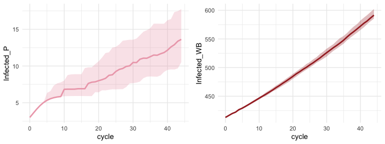<!-- -->

``` r
S0_I <- S0 %>%
  group_by(Sim) %>%
  summarise(I_P = max(Infected_P)) %>%
  mutate(S = '00')
```

    ## `summarise()` ungrouping output (override with `.groups` argument)

## Map

``` r
Hx_sim <- ReadSims(dir = "../../Data/Period_1/Sims/S00/Agents/")
Hx <- st_read("../../Data/Period_1/out/Hx.shp", quiet = T)

Hx_sim <- Hx_sim %>%
  mutate(idhex = as.character(idhex)) %>%
  unfold(., "Disease_status") %>%
  group_by(idhex) %>%
  summarise_at(.vars = c('Epidemic', 'introduction_ph', 'introduction_wb'), .funs = sum)

Hx %>%
  left_join(Hx_sim, by = 'idhex') %>%
  filter(!is.na(Pop)) %>%
  ggplot() +
  geom_sf(aes(fill = Epidemic))
```

<!-- -->

``` r
Hx %>%
  left_join(Hx_sim, by = 'idhex') %>%
  filter(!is.na(Pop)) %>%
  mutate(Epidemic = ifelse(is.na(cases), Epidemic, 0)/50,
         index_case = ifelse(is.na(cases), NA, 1)) %>%
  ggplot() +
  geom_sf(aes(fill = Epidemic)) +
  geom_sf(data = subset(Hx, !is.na(cases)), fill = "red4")
```

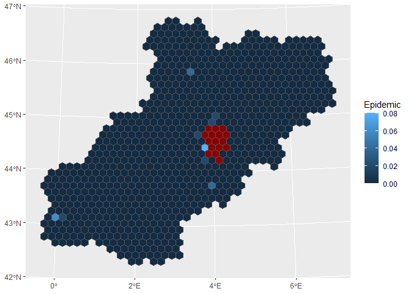<!-- -->

``` r
Hx_sim %>%
  arrange(desc(introduction_ph))
```

    ## # A tibble: 845 x 4
    ##    idhex Epidemic introduction_ph introduction_wb
    ##    <chr>    <dbl>           <int>           <int>
    ##  1 784         24               8              37
    ##  2 1014         0               0               0
    ##  3 1015         0               0               0
    ##  4 1016         0               0               0
    ##  5 1017         0               0               0
    ##  6 1018         0               0               0
    ##  7 1019         0               0               0
    ##  8 1020         0               0               0
    ##  9 1021         0               0               0
    ## 10 1022         0               0               0
    ## # ... with 835 more rows

``` r
Hx %>%
  left_join(Hx_sim, by = 'idhex') %>%
  filter(!is.na(Pop)) %>%
  mutate(Epidemic = ifelse(is.na(cases), Epidemic, 0)/50,
         index_case = ifelse(is.na(cases), NA, 1)) %>%
  ggplot() +
  geom_sf(aes(fill = introduction_ph))
```

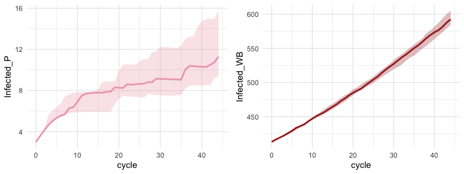<!-- -->

``` r
Hx %>%
  left_join(Hx_sim, by = 'idhex') %>%
  filter(!is.na(Pop)) %>%
  mutate(Epidemic = ifelse(is.na(cases), Epidemic, 0)/50,
         index_case = ifelse(is.na(cases), NA, 1)) %>%
  ggplot() +
  geom_sf(aes(fill = introduction_wb))
```

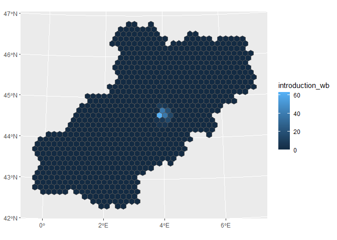<!-- -->

# Scenario 01: Movement restrictions

``` r
S1 <- ReadSims(dir = "../../Data/Period_1/Sims/S01/EC/")

P1 <- PlotCycles(S1, var = "Infected_P", col = "pink2")
P2 <- PlotCycles(S1, var = "Infected_WB", col = "brown")

ggarrange(P1, P2)
```

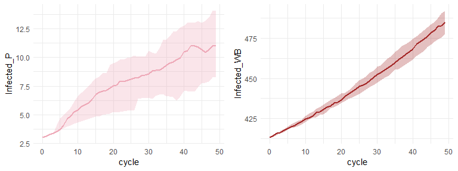<!-- -->

``` r
S1_I <- S1 %>%
  group_by(Sim) %>%
  summarise(I_P = max(Infected_P)) %>%
  mutate(S = '01')
```

    ## `summarise()` ungrouping output (override with `.groups` argument)

## Map

``` r
Hx_sim01 <- ReadSims(dir = "../../Data/Period_1/Sims/S01/Agents/")

Hx_sim01 <- Hx_sim01 %>%
  mutate(idhex = as.character(idhex)) %>%
  unfold(., "Disease_status") %>%
  group_by(idhex) %>%
  summarise_at(.vars = c('Epidemic', 'introduction_ph', 'introduction_wb'), .funs = sum)

Hx %>%
  left_join(Hx_sim01, by = 'idhex') %>%
  filter(!is.na(Pop)) %>%
  mutate(Epidemic = ifelse(is.na(cases), Epidemic, 0)/50,
         index_case = ifelse(is.na(cases), NA, 1)) %>%
  ggplot() +
  geom_sf(aes(fill = Epidemic)) +
  geom_sf(data = subset(Hx, !is.na(cases)), fill = "red4")
```

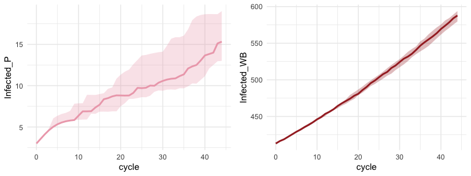<!-- -->

# Scenario 02: Movement restrictions and hunting pressure

``` r
S2 <- ReadSims(dir = "../../Data/Period_1/Sims/S02/EC/")

P1 <- PlotCycles(S2, var = "Infected_P", col = "pink2")
P2 <- PlotCycles(S2, var = "Infected_WB", col = "brown")

ggarrange(P1, P2)
```

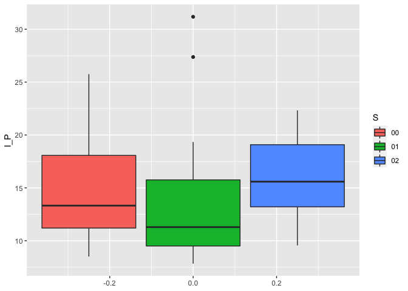<!-- -->

``` r
S2_I <- S2 %>%
  group_by(Sim) %>%
  summarise(I_P = max(Infected_P)) %>%
  mutate(S = '02')
```

    ## `summarise()` ungrouping output (override with `.groups` argument)

``` r
rbind(S0_I, S1_I, S2_I) %>%
  ggplot(aes(y=I_P, fill = S)) +
  geom_boxplot()
```

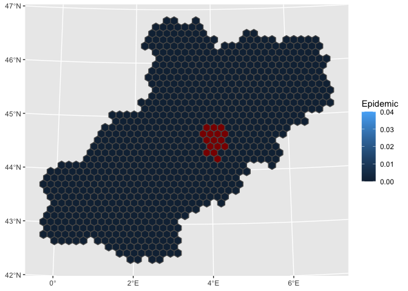<!-- -->

## Map

``` r
Hx_sim02 <- ReadSims(dir = "../../Data/Period_1/Sims/S02/Agents/")

Hx_sim02 <- Hx_sim02 %>%
  mutate(idhex = as.character(idhex)) %>%
  unfold(., "Disease_status") %>%
  group_by(idhex) %>%
  summarise_at(.vars = c('Epidemic', 'introduction_ph', 'introduction_wb'), .funs = sum)

Hx %>%
  left_join(Hx_sim02, by = 'idhex') %>%
  filter(!is.na(Pop)) %>%
  mutate(Epidemic = ifelse(is.na(cases), Epidemic, 0)/50,
         index_case = ifelse(is.na(cases), NA, 1)) %>%
  ggplot() +
  geom_sf(aes(fill = Epidemic)) +
  geom_sf(data = subset(Hx, !is.na(cases)), fill = "red4")
```

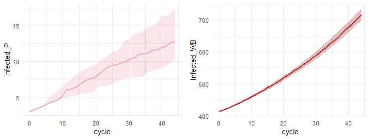<!-- -->

# Scenario 03: Movement restrictions, hunting pressure and fencing

``` r
S3 <- ReadSims(dir = "../../Data/Period_1/Sims/S03/EC/")

P1 <- PlotCycles(S2, var = "Infected_P", col = "pink2")
P2 <- PlotCycles(S2, var = "Infected_WB", col = "brown")

ggarrange(P1, P2)
```

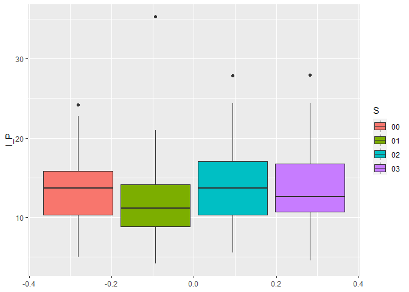<!-- -->

``` r
S3_I <- S3 %>%
  group_by(Sim) %>%
  summarise(I_P = max(Infected_P)) %>%
  mutate(S = '03')
```

    ## `summarise()` ungrouping output (override with `.groups` argument)

``` r
rbind(S0_I, S1_I, S2_I, S3_I) %>%
  ggplot(aes(y=I_P, fill = S)) +
  geom_boxplot()
```

<!-- -->

## Map

``` r
Hx_sim03 <- ReadSims(dir = "../../Data/Period_1/Sims/S02/Agents/")

Hx_sim03 <- Hx_sim03 %>%
  mutate(idhex = as.character(idhex)) %>%
  unfold(., "Disease_status") %>%
  group_by(idhex) %>%
  summarise_at(.vars = c('Epidemic', 'introduction_ph', 'introduction_wb'), .funs = sum)

Hx %>%
  left_join(Hx_sim03, by = 'idhex') %>%
  filter(!is.na(Pop)) %>%
  mutate(Epidemic = ifelse(is.na(cases), Epidemic, 0)/50,
         index_case = ifelse(is.na(cases), NA, 1)) %>%
  ggplot() +
  geom_sf(aes(fill = Epidemic)) +
  geom_sf(data = subset(Hx, !is.na(cases)), fill = "red4")
```

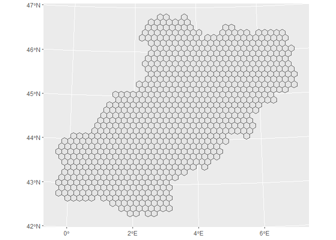<!-- -->
