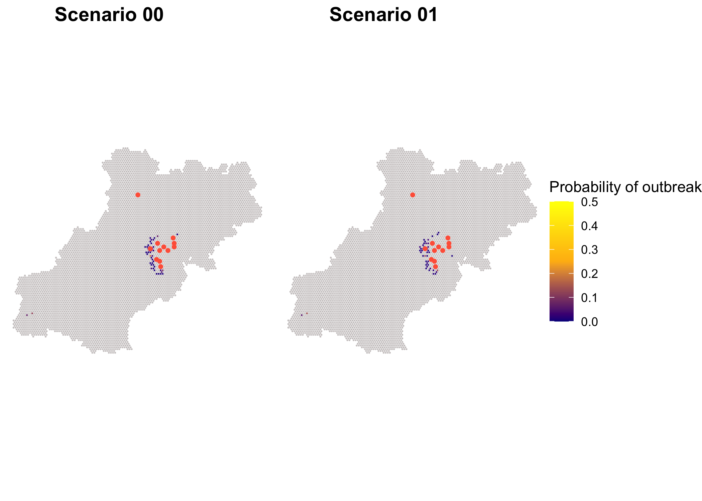
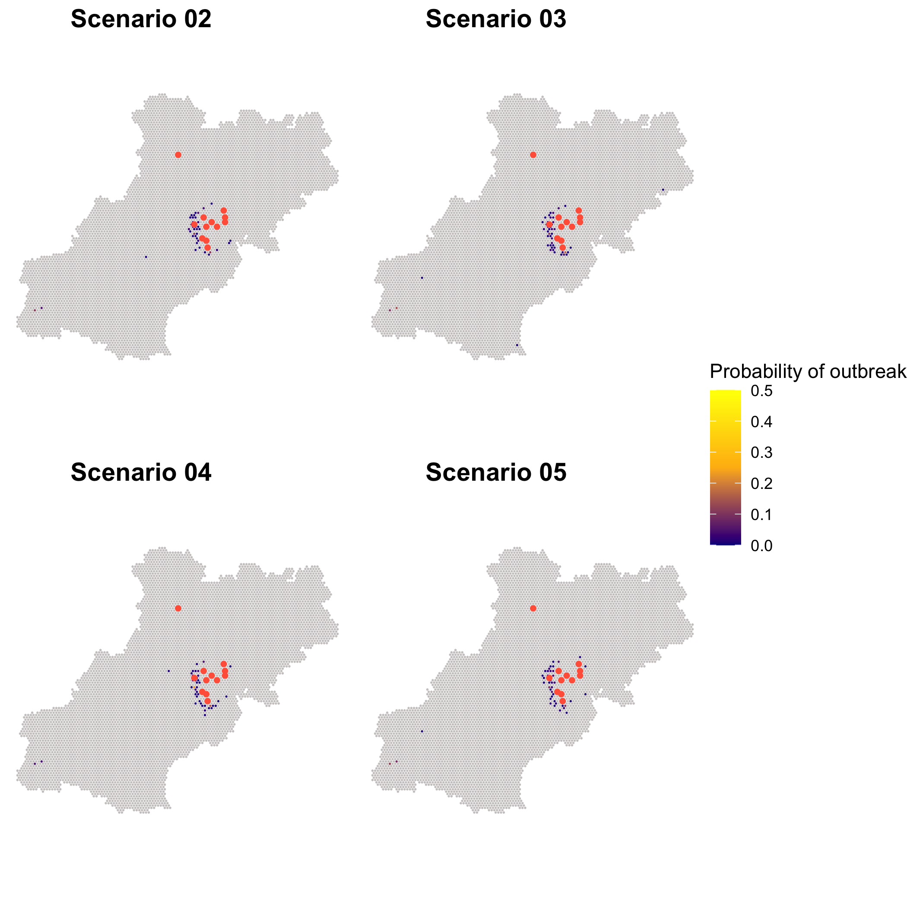
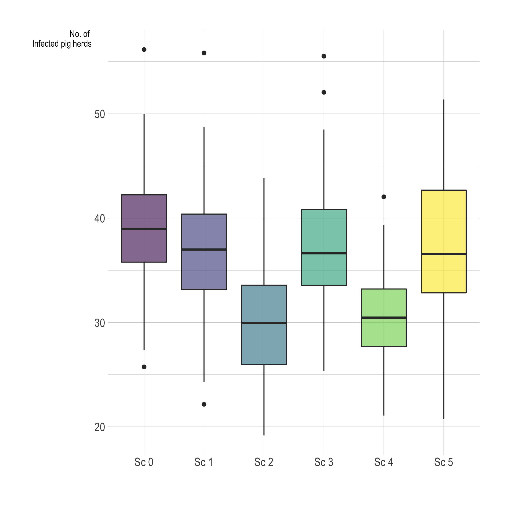

# Model results for second period (Nov 23, 2020)

### Team:

-   Jose Pablo Gomez.
-   Nistara Randawa.
-   Kathleen O'Hara.
-   Jerome Baron
-   Olivia Cords

## Model description

### Mode updates for this submission.

-   Model resolution was updated from 15 km to 5 km.

-   New rates for mortality are added, which also approximates the culling for both of pig herds and wild boars

-   4 /5 interventions were explored in this submission

### Model description.

We use a mechanistic stochastic agent based model. We aggregate the population characteristics in a 5 km diameter hexagonal grid and we use these characteristics to describe the local and long-distance disease spread dynamics. The local disease spread is represented by the disease transmission within each hexagonal cell, where each cell has its own SIR model for both the estimated wild boar population and the pig herds. The two populations interact based on the characteristics of the farms and the density of animals within a hexagonal cell.\
For the long-distance disease spread dynamics we use the land characteristics and estimated wild boar population density to represent the transmission between contiguous cells, and the movement patterns to represent the transmission between longer distances. This modeling approach allows us to account for the spatial heterogeneity in the transmission dynamics with the assumption that the population characteristics within each hexagonal cell are homogeneous.

### Scenario Modeling.

We illustrate the effectiveness of the interventions based on 6 different scenarios, we used two baseline scenarios (fencing with and without hunting pressure), and then compared this baseline to each of the new interventions.

Baseline scenario includes:

-   i - Fencing

-   ii - Hunting pressure

-   iii - Awareness

Interventions explored include:

-   I - Culling of PH in protection zones (3km).

-   II - Culling of PH \< 3 km from detected WB.

-   III - Increasing size of surveillance zone (10 to 15 km during 30 days).

-   IV - Culling of herds that traded with infected farms \< 3 weeks before detection

| Scenario | i   | ii  | iii | I   | II  | III | IV  |
| :------- | :-- | :-- | :-- | :-- | :-- | :-- | :-- |
| S00      | X   | -   | X   | -   | -   | -   | -   |
| S01      | X   | X   | X   | -   | -   | -   | -   |
| S02      | X   | X   | X   | X   | -   | -   | -   |
| S03      | X   | X   | X   | -   | X   | -   | -   |
| S04      | X   | X   | X   | -   | -   | X   | -   |
| S05      | X   | X   | X   | -   | -   | -   | X   |

Each Scenario was run 100 times and we obtained the median and IQR from the Number of infected farms for the next 45 days.

## Model Results:

### Number and location of the predicted outbreaks for the next time period.

### Baseline scenarios

### Interventions

### Effectiveness of fencing

The following plot shows the distribution of the epidemic peak for the 5 scenarios.

#### Reduction of number of pig herds cases when comparing scenarios.

| Scenario | Compared to Scenario 00 | Compared to Scenario 01 |
|:---------|:------------------------|:------------------------|
| 01       | 5.08%                   | \-                      |
| 02       | 23.17%                  | 19.06%                 |
| 03       | 6 %                     | 0.9%                    |
| 04       | 21.82%                  | 17.63%                  |
| 05       | 7.29%                   | 2.33%                   |

### Conclusion

According to our model, scenario 2 is the best followed by scenario 4.
Using the pig herds culling we would expect a reduction of 23.17% of new infections (when compared to fencing, movement restrictions and awareness alone). And using an extended surveillance zone from 10 to 15 km we would expect a decrease in 17.63% of new cases when compared to fencing, movement restrictions and awareness alone.

# Apendix: DataDoc

We provide 2 raw data files:

-   **SDF.csv**: contains each time step of the model for all the 6 scenarios with the variables:

    -   cycle: The time step of the model.\
    -   Infected\_P: The number of infected pig herds.\
    -   Infected\_WB: The number of infected wild boars.\
    -   Sim: Iteration of the scenario.\
    -   Scenario: The corresponding scenario for that run.

-   **AgentsDF.csv**: Contains all the agents for the 6 scenarios ran, each agent (row) is a hexagonal grid cell with the variables:

    -   idhex: a id given to the hexagonal cell.\
    -   Epidemic: Indicates the number of times that cell had a epidemic in the model ran.\
    -   introduction\_ph: Number of times the disease transmission source was a long distance movement.\
    -   introduction\_wb: Number of times the transmission source of the pig herds was from the wild boars.\
    -   Scenario: The corresponding scenario for that agent.
