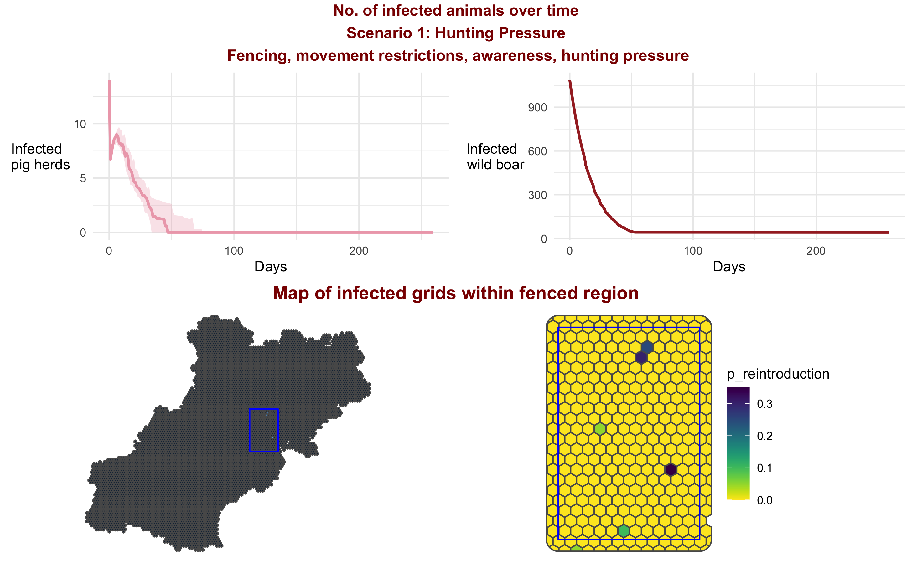

# Model results for second period (Jan 13, 2021)

### Team:

-   Jose Pablo Gomez.
-   Nistara Randawa.
-   Jerome Baron

### Model updates since last submission
  
  - Improved the dynamics of depopulation and farms recovering from the infection.
  - Extended the modeling period to forecast 260 days.  
  - Reparametrized the model to reflect the current disease spread.

### Model description.

We use a mechanistic stochastic agent based model. We aggregate the population characteristics in a 5 km diameter hexagonal grid and we use these characteristics to describe the local and long-distance disease spread dynamics. The local disease spread is represented by the disease transmission within each hexagonal cell, where each cell has its own SIR model for both the estimated wild boar population and the pig herds. The R compartment in our model is used for both the removed animals that have been identified as positives (coming from the I compartment) and the animals that have been culled or hunted (coming from the S compartment). 
The two populations interact based on the characteristics of the farms and the density of animals within a hexagonal cell.\
For the long-distance disease spread dynamics we use the land characteristics and estimated wild boar population density to represent the transmission between contiguous cells, and the movement patterns to represent the transmission between longer distances. This modeling approach allows us to account for the spatial heterogeneity in the transmission dynamics with the assumption that the population characteristics within each hexagonal cell are homogeneous.

On this period, we assume that the fencing and hunting pressure are successful stopping the disease transmission outside the fence. In our model the disease spread is mostly happening inside the fence. For the initial conditions, we use the recently reported cases, and we decided to focus on exploring the events of reintroduction of the disease into areas that are recovering and have been repopulated.

The hexagonal cells can be either disease free, infected, recovered or reintroduced. Once the culling of the farms has been carried on and the population reaches 0, the farm transitions into a recovering phase where it has to be 60 days disease free before being repopulated. If a farm that has been repopulated gets infected again, we consider this as a reintroduction.

#### Scenario Modeling.

We compare the effect of hunting pressure in two scenarios where:
  
  - S00 No hunting pressure.  
  - S01 Hunting pressure.  
  
Both scenarios implement the following interventions:
  
  - Restriction of movements of cells where infected pig herds have been detected.
  - Awareness effect for all the cells (which increases the speed at which animals move from I -> R). 
  - Total culling of pig herds located less than 5 km from a detected carcass (which increases the speed at which pig herds move from S -> R).  

## Model Results:

The following plots show the number of infected farms and wild boars estimated by our model and the probability of reintroduction of the disease after eradication for the two scenarios we defined.  

### Baseline scenario

### Hunting pressure scenario

### Conclusion

Our model suggests that the hunting pressure is necessary to control the disease and avoid getting reintroduction into areas that are recovering and where the re population of pig herds is happening. Its important to notice that we assume that the wild boar population remains stable, and since there is no active surveillance the disease is maintained when there is no hunting pressure and therefore representing a constant infection source for the pig herds.

# Apendix: DataDoc

We provide 2 raw data files:

-   **SDF.csv**: contains each time step of the model for all the 6 scenarios with the variables:

    -   cycle: The time step of the model.\
    -   Infected\_P: The number of infected pig herds.\
    -   Infected\_WB: The number of infected wild boars.\
    -   Sim: Iteration of the scenario.\
    -   Scenario: The corresponding scenario for that run.

-   **AgentsDF.csv**: Contains all the agents for the 6 scenarios ran, each agent (row) is a hexagonal grid cell with the variables:

    -   idhex: a id given to the hexagonal cell.\
    -   Epidemic: Indicates the number of times that cell had a epidemic in the model ran.\
    -   introduction\_ph: Number of times the disease transmission source was a long distance movement.\
    -   introduction\_wb: Number of times the transmission source of the pig herds was from the wild boars.\
    -   Scenario: The corresponding scenario for that agent.