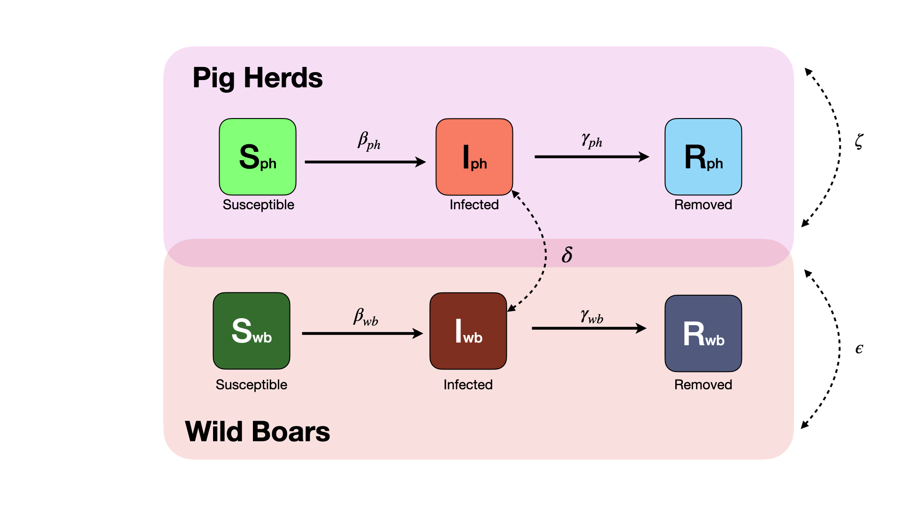

# Model Description

Our model can be described as a metapopulation-agent based model, where the agents are represented by cells in a hexagonal grid aggregating a population with specific characteristics such as: density, land cover, probability and direction of movements, among others. These characteristics make the agents to vary in some of the disease spread parameters allowing to account for the heterogeneity of the disease spread among a bigger population.\
Each of the agents in our model has two SIR models, one at the pig herd level and at the wild boars level. The *S* and *I* compartments represent the susceptible and infectious, and the change between these compartments happens at the rate $\beta_i$ which is computed for every agent. For the pig herds, the $\beta$ is calculated taking in consideration the pig density in the hexagonal cell and its affected by the control measures implemented. For the wild boars, the $\beta$ is computed based on the land cover characteristics, with the assumption that grids with higher forest cover will have a higher transmission. The compartment *R* is used to represent the removed animals, which for the pig herds are the herds that have been detected and culled, and for the wild boars represent the animals that have been either hunted and detected, or found dead and tested positive. For the pig herds, the rate of change between the *I* to *R* compartment is computed based on the probability of detection which starts very low for all the cells, and once the first case has been detected it increases (assuming that after the first case being detected, the detection efforts will increase).

## Parameters of the model

A lot of these parameters are very specific to our model approach, *i.e. the local spread via wild boars considers the probability that in a given day there will a infected wild boar is going to move or infect another outside a 15 km range, which probably is very dependent on a lot of factors such as the habitat, season, etc..* . It will likely be difficult to find exactly what we are interested in but maybe if we find something close that we can use for provide extra support would be great.

+----------------------------------------------------+---------------+--------+---------------------------------------------------------------+
| Parameter                                          | Current value | source | Notes                                                         |
+:===================================================+:==============+:=======+:==============================================================+
| $\beta_{ph}$ Base between herd transmission rate   | (0.1, 0.6)    | None   | Scaled by the population density                              |
+----------------------------------------------------+---------------+--------+---------------------------------------------------------------+
| $\beta_{wb}$ Base wild boars transmission rate     | 0.01          | None   | Scaled by landscape characteristics                           |
+----------------------------------------------------+---------------+--------+---------------------------------------------------------------+
| $\gamma_{wb}$ Base wild boar detection rate        | 0.003         | None   | Scaled by interventions                                       |
+----------------------------------------------------+---------------+--------+---------------------------------------------------------------+
| $\epsilon$ Local spread via wild boars             | 0.3           | None   | Scaled by interventions                                       |
+----------------------------------------------------+---------------+--------+---------------------------------------------------------------+
| $\gamma_{ph}$ Base between herd detection rate     | 0.05          | None   | Scaled by interventions                                       |
+----------------------------------------------------+---------------+--------+---------------------------------------------------------------+
| Hunting pressure effect                            | 0.10          | None   | Describes how much reduction in the WB pop after intervention |
+----------------------------------------------------+---------------+--------+---------------------------------------------------------------+
| Hunting pressure speed                             | x40           | None   | How much the $\gamma_{wb}$ increases after the intervention   |
+----------------------------------------------------+---------------+--------+---------------------------------------------------------------+
| $\delta$ Probability of domestic-wild boars spread | 0.01-0.5      | None   | Scaled by the number of outdoor farms                         |
+----------------------------------------------------+---------------+--------+---------------------------------------------------------------+

{width="599"}

## Scenarios

-   **Scenario 0** assume that there is no intervention at all after the introduction of the disease.
-   **Scenario 1** implements the movement restrictions and that there is a increased awareness after detecting the disease in a given hexagonal cell.
-   **Scenario 2** Considers the same interventions as scenario 1, plus the implementation of a physical barrier, which has a direct impact in the probability of disease spread between cells via the wild boar populations.
-   **Scenario 3** Considers same interventions as previous scenarios plus the increased hunting pressure in the areas where the disease has been detected, which has a direct effect in the rate at which the wild boars are removed from the population.

Each Scenario was run 100 times and we obtained the median and IQR from the Number of infected farms for the next 45 days.

## Notes from Kathleen

-   Avg territory size 1.1-3.9 sq km (boitani 1994) wild boar lives in a family party that has a territory of 10 - 20 sq km but in the autumn, family groups come together to form herds of up to 50 females and youngsters.
