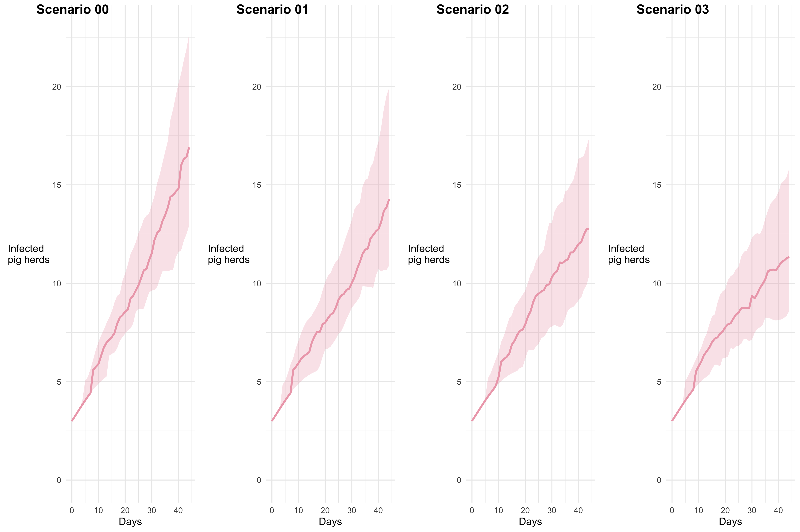
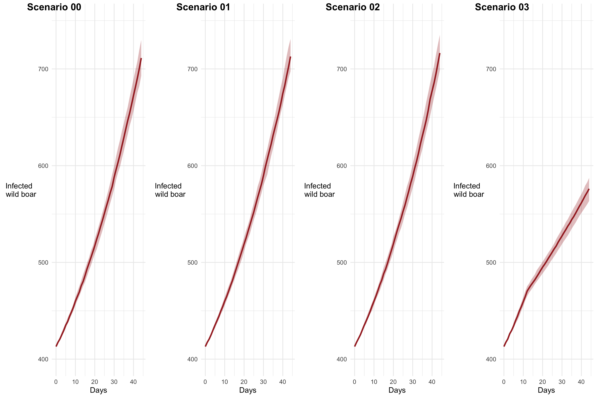
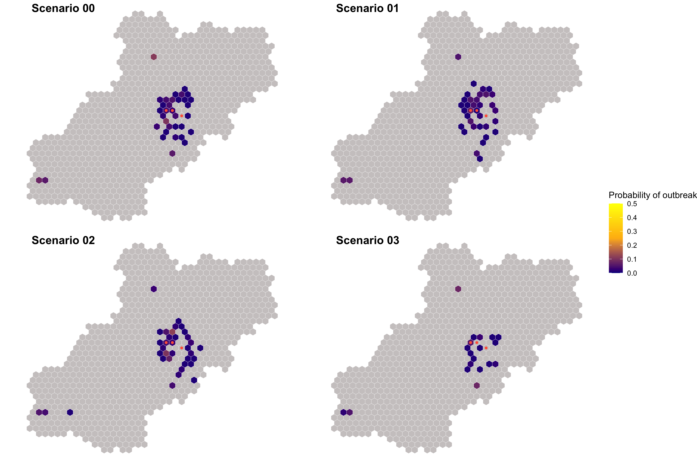
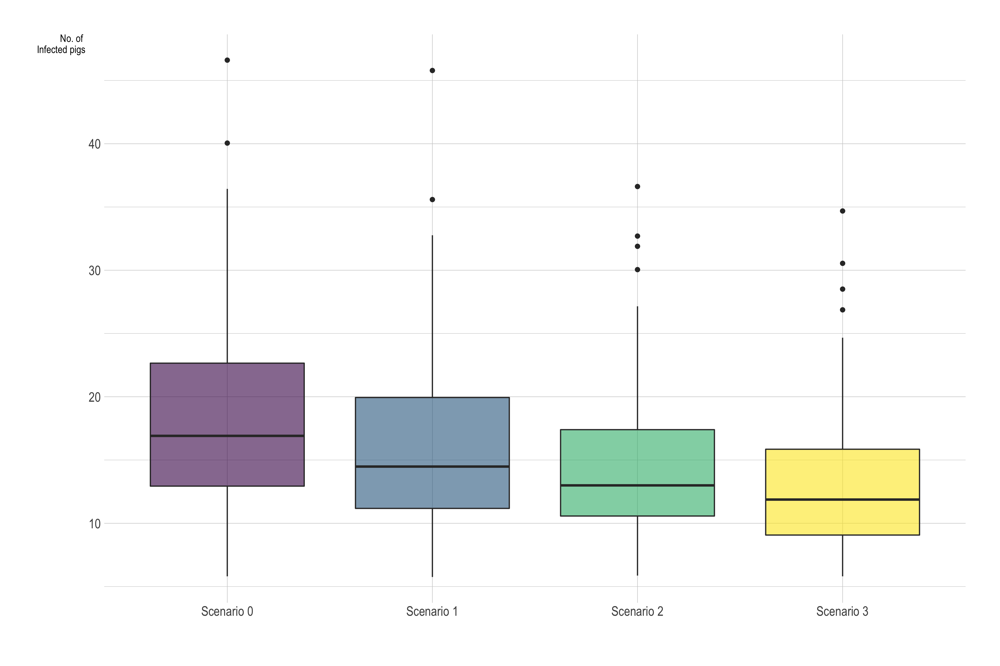

# Model results for first period (Oct 8, 2020)

### Team:

-   Jose Pablo Gomez.
-   Nistara Randawa.
-   Kathleen O'Hara.

## Model description

We use a mechanistic stochastic agent based model. We aggregate the population characteristics in a 15 km diameter hexagonal grid and we use these characteristics describe the local and long-distance disease spread dynamics. The local disease spread is represented by the disease transmission within each hexagonal cell, where each cell has its own SIR model for both the estimated wild boar population and the pig herds. The two populations interact based on the farm characteristics and the density of animals within a hexagonal cell.\
For the long-distance disease spread dynamics we use the land characteristics and estimated wild boar population density to represent the transmission between contiguous cells, and the movement patterns to represent the transmission between longer distances. This modeling approach allow us to account for the spatial heterogeneity in the transmission dynamics with the assumption the population characteristics within each hexagonal cell are homogeneous.

We illustrate the effectiveness of the interventions based on 4 different scenarios:

-   **Scenario 0** assumes that there is no intervention at all after the introduction of the disease.
-   **Scenario 1** implements the movement restrictions and that there is a increased awareness after detecting the disease in a given hexagonal cell.
-   **Scenario 2** Considers the same interventions as scenario 1, plus the implementation of a physical barrier, which has a direct impact in the probability of disease spread between cells via the wild boar populations.  
-   **Scenario 3** Considers same interventions as previous scenarios plus the increased hunting pressure in the areas where the disease has been detected, which has a direct effect in the rate at which the wild boars are removed from the population.  

Each Scenario was run 100 times and we obtained the median and IQR from the Number of infected farms for the next 45 days.

## Model Results:

### Number and location of the predicted outbreaks for the next time period.

The following plot depicts the numbers of pigs infected with ASF under the different scenarios.

The following plot depicts the numbers of wild boars infected with ASF under the different scenarios. 

The following maps predicts the probability that a given hexagonal grid will present a outbreak in the following 45 days:

### Effectiveness of fencing

The following plot shows the distribution of the epidemic peak for the 4 scenarios.

### Conclusion

According to our results, the effect of fencing will reduce the epidemic peak size by 23.14% and when we add hunting pressure the estimated epidemic peak size decreases by 29.77%. Our model concludes that both interventions would be beneficial for controlling the disease spread in the wild boar and pig herds. Given a 45 day window, we may be too early in the timeline to observe significant impacts considering the incubation period for new infections.  
  
# Apendix: DataDoc
We provide 2 raw data files:  
  
  - **SDF.csv**: contains each time step of the model for all the 4 scenarios with the variables:  
    - cycle: The time step of the model.  
    - Infected_P: The number of infected pig herds.  
    - Infected_WB: The number of infected wild boars.  
    - Sim: Iteration of the scenario.  
    - Scenario: The corresponding scenario for that run.  
    
  - **AgentsDF.csv**: Contains all the agents for the 4 scenarios ran, each agent (row) is a hexagonal grid cell with the variables:  
    - idhex: a id given to the hexagonal cell.  
    - Epidemic: Indicates the number of times that cell had a epidemic in the model ran.  
    - introduction_ph: Number of times the disease transmission source was a long distance movement.  
    - introduction_wb: Number of times the transmission source of the pig herds was from the wild boars.  
    - Scenario: The corresponding scenario for that agent.  
