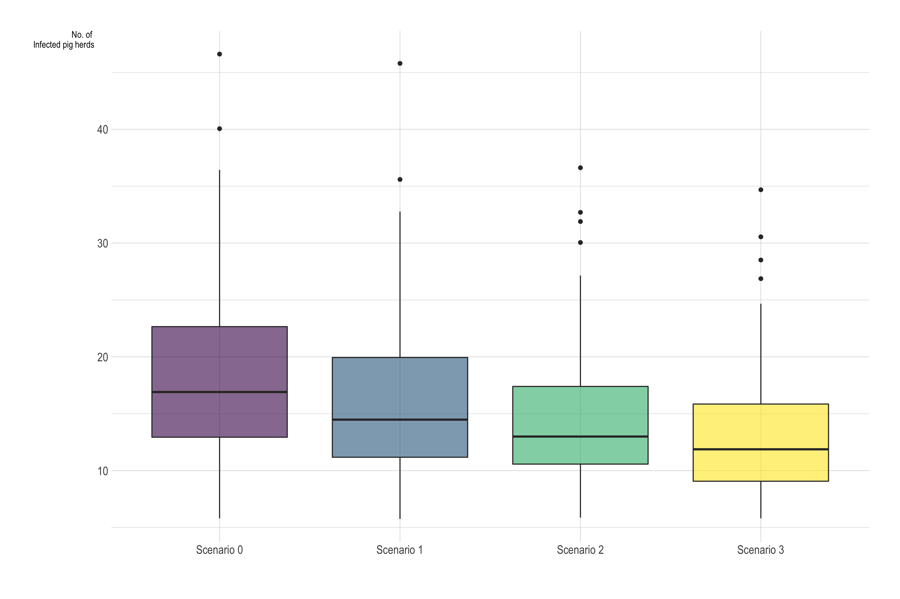

# Model results for first period (Oct 8, 2020)

### Team:

-   Jose Pablo Gomez.
-   Nistara Randawa.
-   Kathleen O'Hara.

## Model description

We use a mechanistic stochastic agent based model. We aggregate the population characteristics in a 15 km diameter hexagonal grid and we use these characteristics describe the local and long-distance disease spread dynamics. The local disease spread is represented by the disease transmission within each hexagonal cell, where each cell has its own SIR model for both the estimated wild boar population and the pig herds. The two populations interact based on the farm characteristics and the density of animals within a hexagonal cell.\
For the long-distance disease spread dynamics we use the land characteristics and estimated wild boar population density to represent the transmission between contiguous cells, and the movement patterns to represent the transmission between longer distances. This modeling approach allow us to account for the spatial heterogeneity in the transmission dynamics with the assumption the population characteristics within each hexagonal cell are homogeneous.

We illustrate the effectiveness of the interventions based on 4 different scenarios:

-   **Scenario 0** assumes that there is no intervention at all after the introduction of the disease.
-   **Scenario 1** implements the movement restrictions and that there is a increased awareness after detecting the disease in a given hexagonal cell.
-   **Scenario 2** Considers the same interventions as scenario 1, plus the increased hunting pressure in the areas where the disease has been detected, which has a direct effect in the rate at which the wild boars are removed from the population.
-   **Scenario 3** Considers same interventions as precious scenarios plus the implementation of the physical barrier, which has a direct impact in the probability of disease spread between cells via the wild boar populations.

## Model Results:

### Number and location of the predicted outbreaks for the next time period.
The following plot depicts the numbers of pigs infected with ASF under the different scenarios. 

The following plot depicts the numbers of wild boars infected with ASF under the different scenarios. 

The following maps predicts the probability that a given hexagonal grid will present a outbreak in the following 45 days:

### Effectiveness of fencing

The estimated median number of infected pig herds is decreased by 23.14% when the fencing of infected zones is implemented. When we add hunting pressure the estimated median number of infected pig herds decreases by 29.77%

### Conclusion
In the initial 30 day period of evaluation, we do not see marked differences across the median number of infected populations under the different intervention scenarios.  However, we do observe that with intervention the outliers representing larger size outbreaks are prevented, and in general our confidence in the size, and restriction of the size, of outbreaks improved with intervention.  Given a 30 day window, we may be too early in the timeline to observe significant impacts considering the incubation period for new infections may extend to 15 days.
